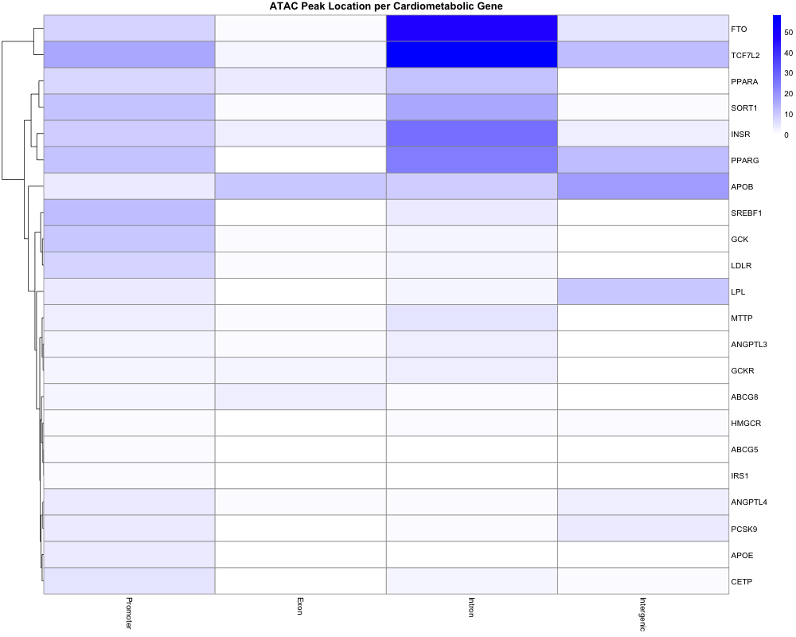
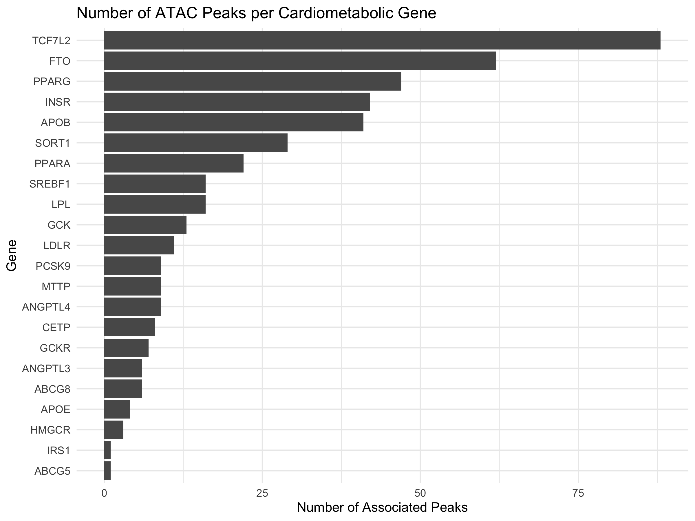

# ATAC-seq Cardiometabolic Analysis

## Introduction
Cardiometabolic diseases (heart disease, obesity, type 2 diabetes) are influenced by genetic risk variants.

However, many risk variants: Do not fall in coding regions, Instead occur in regulatory DNA

Our goal:
To understand how chromatin accessibility near cardiometabolic genes is regulated specifically in liver cells. 

This project explores chromatin accessibility in liver tissue and its association with cardiometabolic genes.

## Key Results

- Enrichment of cardiometabolic genes in ATAC peaks  
- Odds ratio ~2.07 (p < 0.001)

## Figures

_Findings
-This heatmap shows the distribution of ATAC-seq peaks across cardiometabolic genes in different genomic regions (promoter, exon, intron, intergenic). Darker coloring indicates higher chromatin accessibility.

The presence of ATAC peaks across many cardiometabolic genes indicates that these genes are associated with open chromatin, which reflects active regulatory DNA. This supports the hypothesis that regulatory elements play a role in disease risk.

There is strong enrichment of peaks in intronic and promoter regions, while exon regions show very low accessibility. Since promoters and introns commonly contain regulatory elements such as enhancers and transcription start sites, this suggests that gene regulation—rather than coding sequence changes—is a key mechanism influencing these genes.

Intronic regions show the highest level of accessibility across many genes, including FTO, TCF7L2, PPARG, and INSR. This is important because introns often contain enhancer elements that control gene expression in a tissue-specific manner. This supports the idea that regulatory DNA contributes to cardiometabolic risk.

Although the heatmap does not directly compare multiple tissues, the data is derived from liver ATAC-seq. Therefore, the observed chromatin accessibility patterns reflect regulatory activity in liver cells, supporting the liver-specific aspect of the hypothesis.

This is a Quarto website.

To learn more about Quarto websites visit <https://quarto.org/docs/websites>.
