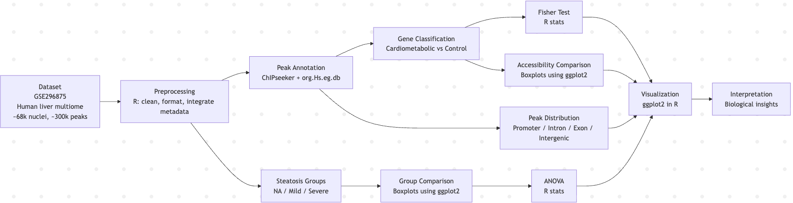

## Research question
Cardiometabolic diseases are strongly linked to liver function, but the role of chromatin accessibility in regulating these genes is not fully understood. In this project, we analyze a human liver single-nucleus ATAC-seq dataset to evaluate whether cardiometabolic genes are enriched in accessible chromatin regions, where these regions are located within genes, and how chromatin accessibility changes across steatosis severity.

## Introduction

Cardiometabolic diseases, including diabetes, obesity, and non-alcoholic fatty liver disease (NAFLD), are increasing globally and represent a major public health concern. The liver plays a central role in lipid metabolism and glucose homeostasis, making it a key organ in disease progression ([Currin et al., 2021](https://pubmed.ncbi.nlm.nih.gov/34038741/); [Broadaway et al., 2024](https://pubmed.ncbi.nlm.nih.gov/39173627/)). These metabolic processes are tightly regulated at the genomic level, where disruptions can contribute to disease development ([Wilson et al., 2025](https://pubmed.ncbi.nlm.nih.gov/40992379/)).

While genome-wide association studies (GWAS) have identified many genetic variants linked to cardiometabolic disease, the biological mechanisms connecting these variants to gene regulation remain unclear ([Schmitt et al., 2015](https://pubmed.ncbi.nlm.nih.gov/25559105/); [Zhang et al., 2023](https://academic.oup.com/gpb/article/23/6/qzaf115/8340039)). Understanding how regulatory DNA elements influence gene expression is critical for linking genetic variation to disease phenotypes ([Schmitt et al., 2015](https://pubmed.ncbi.nlm.nih.gov/25559105/)).

Chromatin accessibility is a key factor influencing gene regulation. Open chromatin regions allow transcription factors to bind DNA and regulate gene expression, while closed chromatin restricts access ([Calderon et al., 2022](https://elifesciences.org/articles/72792)). These accessible regions are often located in regulatory elements such as promoters, enhancers, and introns, which play critical roles in controlling gene activity ([Li et al., 2023](https://www.sciencedirect.com/science/article/abs/pii/S1567576923001261)). Changes in chromatin accessibility have also been linked to disease progression and cellular dysfunction ([Wang et al., 2022](https://pmc.ncbi.nlm.nih.gov/articles/PMC9116206/)).

ATAC-seq (Assay for Transposase-Accessible Chromatin using sequencing) is a widely used technique to identify open chromatin regions across the genome. By inserting sequencing adapters into accessible DNA, ATAC-seq enables high-resolution mapping of regulatory regions and provides insight into gene regulation ([Wang et al., 2022](https://pmc.ncbi.nlm.nih.gov/articles/PMC9116206/); [Currin et al., 2021](https://pubmed.ncbi.nlm.nih.gov/34038741/)). This method has been applied across multiple tissues and disease contexts, including metabolic disorders and liver disease ([Broadaway et al., 2024](https://pubmed.ncbi.nlm.nih.gov/39173627/); [Wilson et al., 2025](https://pubmed.ncbi.nlm.nih.gov/40992379/)).

Recent advances in single-nucleus multiomic technologies have enabled the simultaneous measurement of chromatin accessibility and gene expression at the cellular level. A recent study analyzing human liver tissue from 39 individuals identified over 68,000 nuclei and more than 300,000 accessible chromatin regions, providing a high-resolution view of liver gene regulation ([Primary Study, 2025](https://pubmed.ncbi.nlm.nih.gov/41338218/)). These high-resolution datasets allow researchers to examine chromatin accessibility patterns across both cell types and disease states ([Primary Study, 2025](https://pubmed.ncbi.nlm.nih.gov/41338218/)).

Integrating chromatin accessibility with genetic and transcriptomic data has been shown to improve understanding of disease mechanisms. Regulatory DNA regions can mediate genetic risk for cardiometabolic traits by influencing gene expression patterns ([Schmitt et al., 2015](https://pubmed.ncbi.nlm.nih.gov/25559105/); [Zhang et al., 2023](https://academic.oup.com/gpb/article/23/6/qzaf115/8340039)). Additional work highlights the role of chromatin accessibility in cellular regulation and disease progression ([Calderon et al., 2022](https://elifesciences.org/articles/72792); [Li et al., 2023](https://www.sciencedirect.com/science/article/abs/pii/S1567576923001261); [Wang et al., 2022](https://pmc.ncbi.nlm.nih.gov/articles/PMC9116206/)).

Despite these advances, there is still a gap in understanding how chromatin accessibility specifically relates to cardiometabolic genes within liver tissue and how these patterns change across disease states ([PubMed Study, 2024](https://pubmed.ncbi.nlm.nih.gov/39986281/); [PubMed Study, 2025](https://pubmed.ncbi.nlm.nih.gov/41218612/)). Addressing this gap is important for identifying regulatory mechanisms that contribute to disease progression and may provide insight into potential therapeutic targets ([PubMed Study, 2024](https://pubmed.ncbi.nlm.nih.gov/39986281/)).

In this study, we analyze a human liver single-nucleus ATAC-seq dataset derived from 39 deceased liver samples (~68,000 nuclei and ~300,000 accessible regions). Steatosis severity information was obtained from supplemental data and used to group samples into NA/None, Mild/Moderate, and Severe. We evaluate gene enrichment, peak location, and changes in chromatin accessibility across disease severity.

**Hypothesis: Cardiometabolic genes are enriched in accessible chromatin, accessible regions are concentrated in regulatory regions such as promoters and introns, and chromatin accessibility changes across steatosis severity groups, reflecting its role in gene regulation and disease progression.**

## Methods Pipeline Diagram

## Dataset(s)

- **Source:** Gene Expression Omnibus (GEO), accession GSE296875; human liver single-nucleus multiome dataset (RNA-seq + ATAC-seq) from the study associated with PMID: 41338218  

- **Sample size:** 39 deceased human liver samples (~68,000 nuclei total), with approximately 300,000 accessible chromatin regions (ATAC-seq peaks). Samples were grouped by steatosis severity using supplemental metadata from the original study:
  - NA/None (n = 19)  

  - Mild/Moderate (n = 16) 

  - Severe (n = 4)  

- **Key variables:**

  - Chromatin accessibility peaks (genomic coordinates from ATAC-seq)

  - Gene annotations (mapped using ChIPseeker)

  - Gene expression data (from matched RNA-seq modality)

  - Gene classification:
    - Cardiometabolic genes (genes associated with metabolic disease)
    - Control group defined as all remaining non-cardiometabolic genes in the dataset

  - Peak location within genes (promoter, intron, exon, intergenic regions)

  - Steatosis severity group:
    - NA/None (used as the baseline control group)
    - Mild/Moderate
    - Severe
    
- **License/usage notes:**
  - Publicly available dataset from GEO (NCBI)
  - Derived from de-identified human samples; no personally identifiable information
  - Intended for research and educational use
  - Requires proper citation of the original study (PMID: 41338218)

## Planned analysis

- **Cleaning / QC**
  - Load ATAC-seq peak dataset and verify genomic coordinate formatting and gene annotations

  - Remove missing or inconsistent entries and ensure accurate peak-to-gene mapping 

  - Integrate steatosis metadata from the supplemental information of the original study 

  - Group samples into three categories: NA/None, Mild/Moderate, and Severe  

  - Confirm consistency between peak data and sample-level metadata across the 39 liver samples  

- **Visualizations**
  - Bar plots to compare proportion of genes with ATAC peaks (cardiometabolic vs control) 

  - Heatmaps to visualize distribution of peaks across genomic regions (promoter, intron, exon, intergenic)  

  - Boxplots to compare chromatin accessibility between cardiometabolic and control genes 

  - Boxplots to assess differences in chromatin accessibility across steatosis severity groups  

- **Statistical / analytical approach**
  - Fisher’s Exact Test to evaluate enrichment of ATAC peaks in cardiometabolic vs control genes  

  - ANOVA to test for differences in chromatin accessibility across steatosis groups (NA/None, Mild/Moderate, Severe) 

  - Descriptive statistics to summarize peak distributions and variability  

- **Validation / robustness checks**
  - Cross-check peak annotation categories (promoter, intron, exon, intergenic) for consistency  

  - Compare results across multiple visualizations to ensure patterns are reproducible 

  - Evaluate statistical significance (p-values) to confirm observed trends 

  - Assess within-group variability to ensure results are not driven by outliers 

  - Verify steatosis group assignments using supplemental metadata from the original study  

- **Website sections**
  - One-paragraph summary and Abstract → *index.qmd*  

  - Introduction (background, motivation, rationale, and hypothesis) → *proposal.qmd*  

  - Dataset description (including multiome ATAC-seq + RNA-seq data and steatosis metadata) → *proposal.qmd*  

  - Methods (data processing, peak annotation, and analysis pipeline) → *proposal.qmd* 

  - Results (figure-by-figure analysis with clear interpretation) → *results.qmd*  

  - Discussion (synthesis of findings and connection to literature) → *results.qmd* 

  - Limitations and future work → *results.qmd*  

  - References with cited sources → *references.bib*  

  - Team contributions → *team.qmd*  

- **Key figures/tables**
  - Bar plot showing proportion of cardiometabolic vs control genes associated with ATAC-seq peaks

  - Fisher’s Exact Test results (table or figure) demonstrating statistical significance of enrichment  

  - Heatmap showing distribution of chromatin accessibility across genomic regions 

  - Bar plot of peak locations (promoter, intron, exon, intergenic) 

  - Boxplot comparing chromatin accessibility between cardiometabolic and control genes 

  - Boxplot comparing chromatin accessibility across steatosis severity groups (NA/None, Mild/Moderate, Severe)  

  - ANOVA results summary (table or figure) showing differences in accessibility across disease groups  

