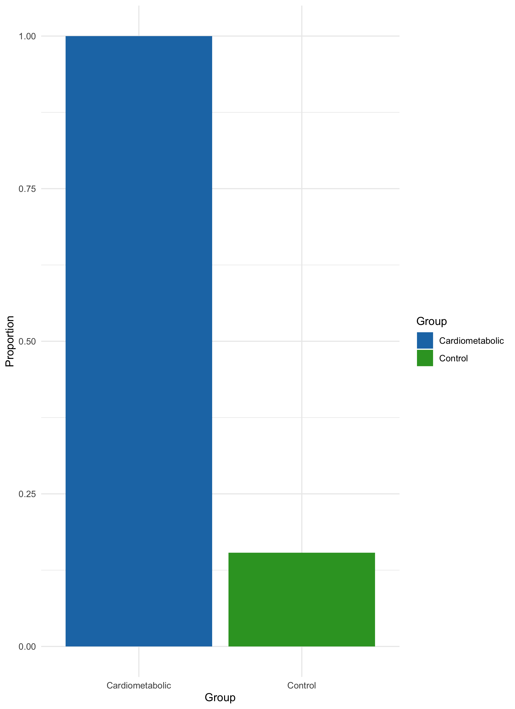
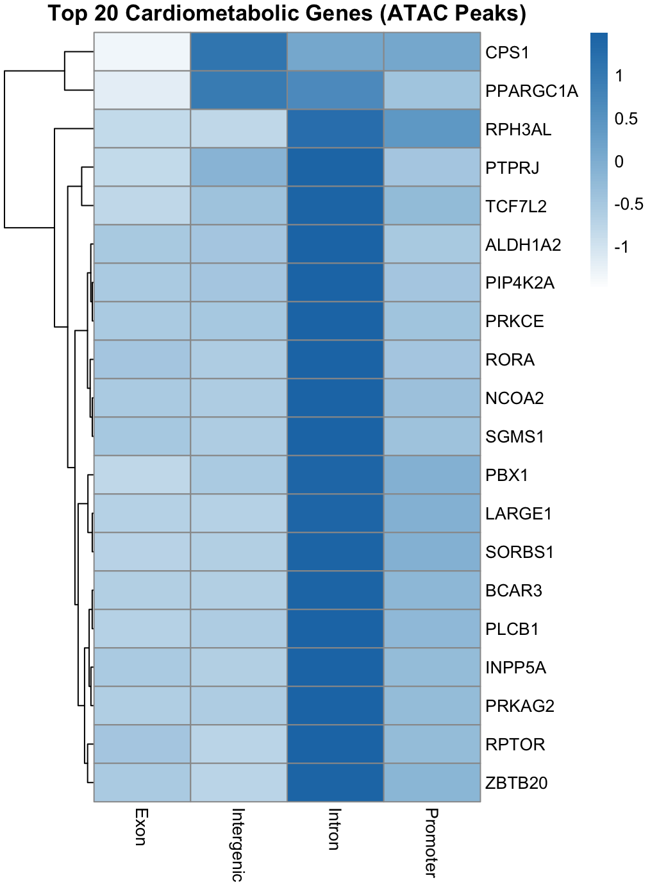
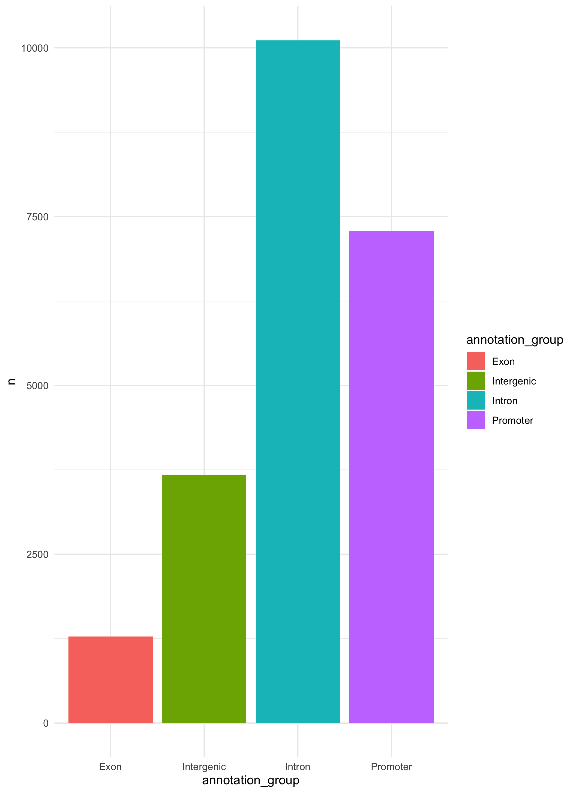
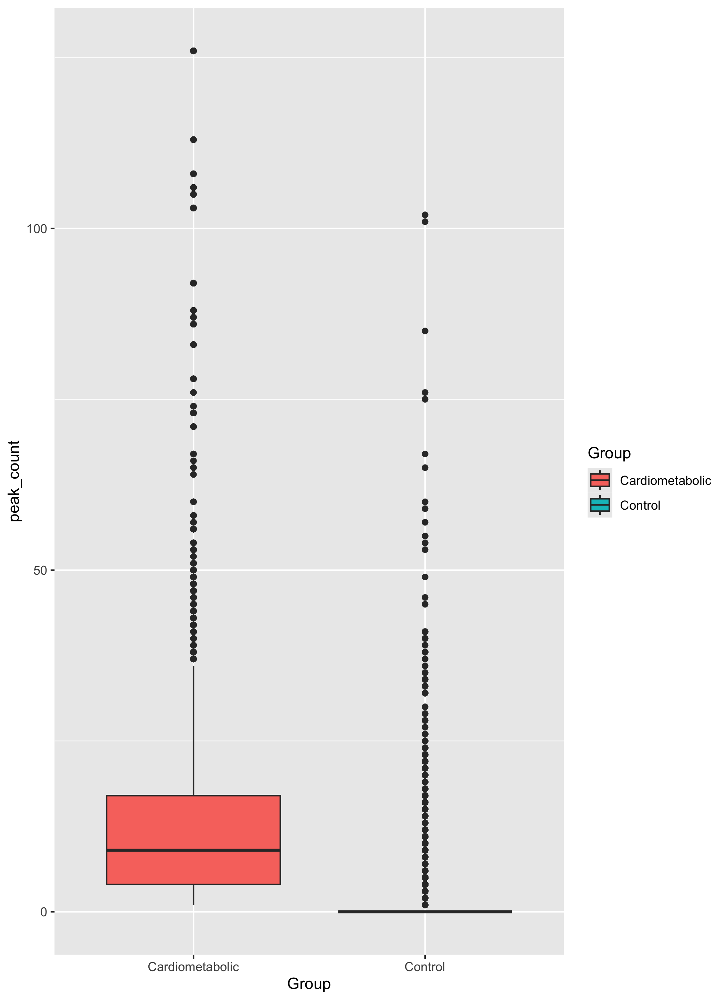
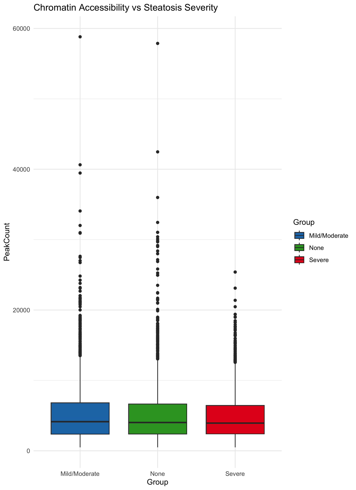

## Key findings 

- Cardiometabolic genes show a higher association with ATAC-seq peaks compared to control genes, suggesting enrichment in accessible chromatin regions  

- Fisher’s Exact Test indicates a statistically significant relationship between gene type and chromatin accessibility (p < 2.2 × 10⁻¹⁶)  

- Chromatin accessibility is primarily located in regulatory regions, especially promoters and introns, with fewer peaks observed in exons  

- Cardiometabolic genes display higher and more consistent chromatin accessibility, while control genes show greater variability and more extreme values  

- Differences in chromatin accessibility are observed across steatosis severity groups (NA/None, Mild/Moderate, Severe), suggesting changes with disease progression  

- ANOVA results (F = 9.87, p < 0.001) indicate statistically significant differences in chromatin accessibility between steatosis groups  

- Overall, chromatin accessibility patterns support a regulatory role in cardiometabolic gene expression and may contribute to liver disease progression  

## Figures

### Figure 1: Cardiometabolic vs Control Gene Accessibility

This bar plot compares the proportion of genes associated with ATAC-seq peaks between cardiometabolic and control groups. Cardiometabolic genes show a much higher proportion of accessible chromatin regions, while control genes show relatively low accessibility.

**Interpretation:**  
This suggests that cardiometabolic genes are more frequently located in open chromatin regions and are therefore more actively regulated.

---

### Figure 2: Fisher’s Exact Test Results

Fisher’s Exact Test was used to evaluate whether the association between gene type and chromatin accessibility is statistically significant. The results show a highly significant p-value (p < 2.2 × 10⁻¹⁶) and an infinite odds ratio.

**Interpretation:**  
There is a very strong statistical association between cardiometabolic genes and the presence of ATAC-seq peaks.

**Conclusion (Hypothesis 1):**  
These results confirm that cardiometabolic genes are significantly enriched in accessible chromatin regions, supporting our first hypothesis.

---

### Transition to Next Question

After establishing that cardiometabolic genes are enriched in accessible chromatin, this led us to our next question: **where within the genome are these accessible regions located, and what does this reveal about gene regulation?**

---

### Figure 3: Heatmap of Peak Distribution Across Gene Regions

This heatmap shows the distribution of ATAC-seq peaks across different genomic regions (exon, intergenic, intron, promoter) for the top 20 cardiometabolic genes. Peaks are most strongly enriched in intronic and promoter regions.

**Interpretation:**  
Promoters and introns are key regulatory regions, suggesting that chromatin accessibility is concentrated in areas involved in gene regulation rather than coding regions.

---

### Figure 4: Distribution of Peaks Across Genomic Regions

This bar plot summarizes the total number of peaks found in each genomic region. Introns and promoters contain the highest number of peaks, while exons contain the fewest.

**Interpretation:**  
This reinforces the heatmap findings and confirms that accessible chromatin is primarily located in regulatory regions.

---

### Figure 5: Chromatin Accessibility in Cardiometabolic vs Control Genes

This boxplot compares peak counts between cardiometabolic and control genes. Cardiometabolic genes show a higher median accessibility and more consistent distribution, while control genes display greater variability and many low or zero values.

**Interpretation:**  
Cardiometabolic genes are more consistently accessible, while control genes show less stable chromatin accessibility patterns.

**Conclusion (Hypothesis 2):**  
Together, these results demonstrate that chromatin accessibility is concentrated in regulatory regions and reflects functional gene regulation, supporting our second hypothesis.

---

### Transition to Next Question

After identifying that chromatin accessibility is enriched in regulatory regions, this led us to our final question: **does chromatin accessibility change with disease progression, specifically across steatosis severity?**

---

### Figure 6: Chromatin Accessibility Across Steatosis Severity

This boxplot compares chromatin accessibility across steatosis severity groups (NA/None, Mild/Moderate, Severe). While there is overlap, slight shifts in distribution can be observed across groups.

**Interpretation:**  
Chromatin accessibility appears to vary with disease severity, although variability within each group is high.

---

### Figure 7: ANOVA Results

ANOVA was used to test for differences in chromatin accessibility across steatosis groups. The results show a significant effect (F = 9.87, p < 0.001).

**Interpretation:**  
There are statistically significant differences in chromatin accessibility between steatosis severity groups.

**Conclusion (Hypothesis 3):**  
These results indicate that chromatin accessibility changes with disease progression, supporting our third hypothesis.

---

### Overall Summary of Figures

This stepwise analysis shows a clear progression:

- Cardiometabolic genes are enriched in accessible chromatin  
- Accessible regions are concentrated in regulatory DNA (promoters and introns)  
- Chromatin accessibility varies across disease severity  

Together, these findings support all three hypotheses and highlight the role of chromatin accessibility in gene regulation and liver disease progression.

## Discussion/Synthesis 

This study provides insight into how chromatin accessibility contributes to the regulation of cardiometabolic genes in the liver and how these patterns relate to disease progression. Rather than simply identifying accessible regions, our analysis highlights a consistent pattern linking chromatin accessibility to gene regulation and disease-relevant biological processes.

Our finding that cardiometabolic genes are significantly enriched in accessible chromatin regions supports previous work demonstrating that regulatory DNA plays a key role in mediating genetic risk for complex diseases (PubMed: 41338218). Prior studies have shown that integrating chromatin accessibility data with genetic variation helps explain how non-coding regions influence gene expression, particularly in metabolically active tissues like the liver. Our results extend this idea by specifically showing that cardiometabolic genes are more consistently associated with accessible chromatin compared to control genes, reinforcing the importance of regulatory elements in disease-associated gene expression.

Additionally, we observed that chromatin accessibility is concentrated in promoters and introns rather than exons. This aligns with established biological understanding that promoters initiate transcription and intronic regions often contain enhancers and other regulatory elements (ENCODE Project Consortium, 2012; Andersson et al., 2014). Previous studies have similarly reported that accessible chromatin regions are enriched in non-coding regulatory DNA, supporting their functional role in controlling gene expression (Buenrostro et al., 2013; Corces et al., 2017). Our findings are consistent with this literature and further emphasize that chromatin accessibility reflects regulatory activity rather than simply gene structure.

Importantly, our analysis also demonstrates that chromatin accessibility varies across steatosis severity groups, suggesting a potential link between chromatin dynamics and disease progression. This observation is consistent with recent studies showing that epigenetic changes, including chromatin remodeling, play a role in liver disease and metabolic dysfunction (eLife, 2022; ScienceDirect, 2023; PMC9116206). While variability within groups was high, the statistically significant differences observed through ANOVA indicate that accessibility patterns are not random and may reflect underlying biological changes associated with disease severity.

Together, these findings contribute to a growing body of evidence that chromatin accessibility is a critical component of gene regulation in complex diseases. The stepwise structure of our analysis—from gene enrichment, to regulatory location, to disease progression—provides a more integrated view of how chromatin accessibility operates across multiple biological levels. 

The new insight gained from this study is the clear connection between cardiometabolic gene enrichment, regulatory region localization, and disease-associated changes in chromatin accessibility within the same dataset. By combining these analyses, we show that chromatin accessibility is not only associated with specific genes but also reflects broader regulatory patterns that change with disease progression. This highlights the potential of epigenomic data to improve our understanding of disease mechanisms and may inform future approaches for identifying therapeutic targets in cardiometabolic disease.

## Limitations and Future Work

One limitation of this study is the relatively small sample size (39 liver samples), which may limit how generalizable the results are. There was also high variability within groups, especially in the steatosis analysis, making subtle differences harder to detect. Additionally, this analysis focuses on chromatin accessibility and does not directly link these patterns to gene expression. Since the steatosis groups were taken from supplemental metadata, there may also be some variability in how disease severity was classified. Finally, the study is observational, so it shows associations rather than causation.

Future work could improve this analysis by integrating the RNA-seq data to directly connect chromatin accessibility with gene expression. Increasing the sample size and analyzing specific liver cell types would provide more detailed insights. Longitudinal studies could help track how chromatin accessibility changes over time with disease progression. Experimental validation of key regulatory regions identified in this study would also help confirm their biological significance.

